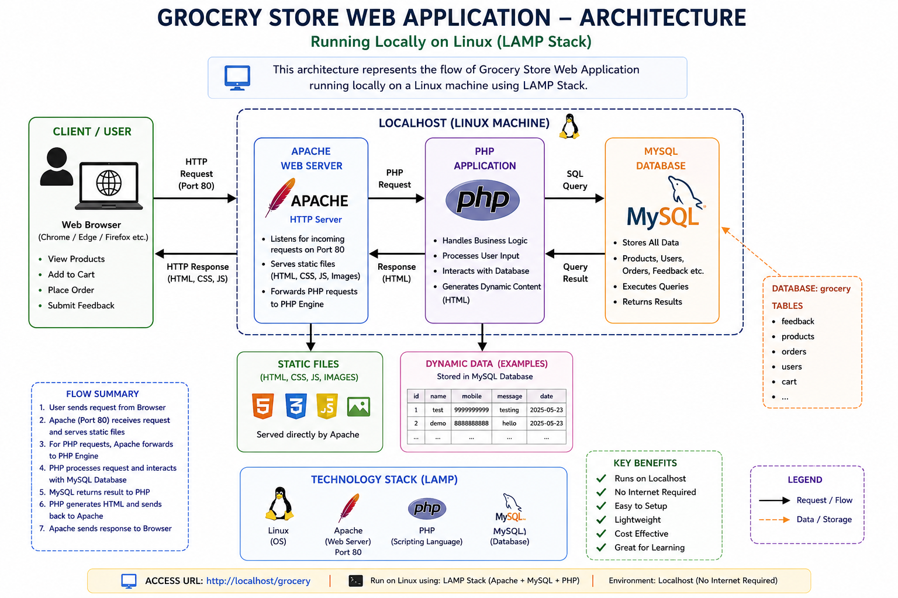

# Grocery DevOps Project (LAMP Stack)

## Architecture

## 📌 Project Overview
This project demonstrates deployment of a Grocery Store Web Application using LAMP Stack on a Linux environment.

---

## 📂 Project Structure
grocery-devops-project/
│
├── application/
│ ├── index.php
│ ├── mail.php
│ ├── dbcon.php
│ ├── header.php
│ └── footer.php
│
├── database/
│ └── grocery.sql
│
├── architecture/
│ └── architecture-diagram.png
│
├── docs/
│ ├── setup-guide.md
│ ├── deployment-guide.md
│ ├── verification.md
│ └── troubleshooting.md
│
├── screenshots/
│ ├── app-homepage.png
│ ├── feedback-form.png
│ ├── feedback-success.png
│ ├── cart-page.png
│ ├── apache-running.png
│ └── mysql-running.png
│
└── README.md

## 🎯 Problem Statement
Deploy a PHP-based application with database connectivity on a local Linux server.

## 🏗️ Architecture
- Client → Apache → PHP → MySQL
- Runs on localhost using LAMP stack

## 🧰 Technologies Used
- Linux
- Apache
- MySQL
- PHP

## 📂 Project Structure
- application → PHP files
- database → SQL file
- architecture → diagram
- screenshots → proof images

## 🚀 Deployment Steps
1. Install LAMP stack
2. Move project to /var/www/html
3. Import database
4. Start Apache & MySQL

## ✅ Verification
- Application runs on browser
- Feedback form saves data in database

## 📸 Screenshots
(Check screenshots folder)

## ⚠️ Challenges
- MySQL access denied error
- DB connection issue

## 📚 Learning
- LAMP deployment
- Debugging database issues

## 🔮 Future Improvements
- Docker deployment
- Cloud hosting

## 👨‍💻 Author
Shivam Kumar Sinha

